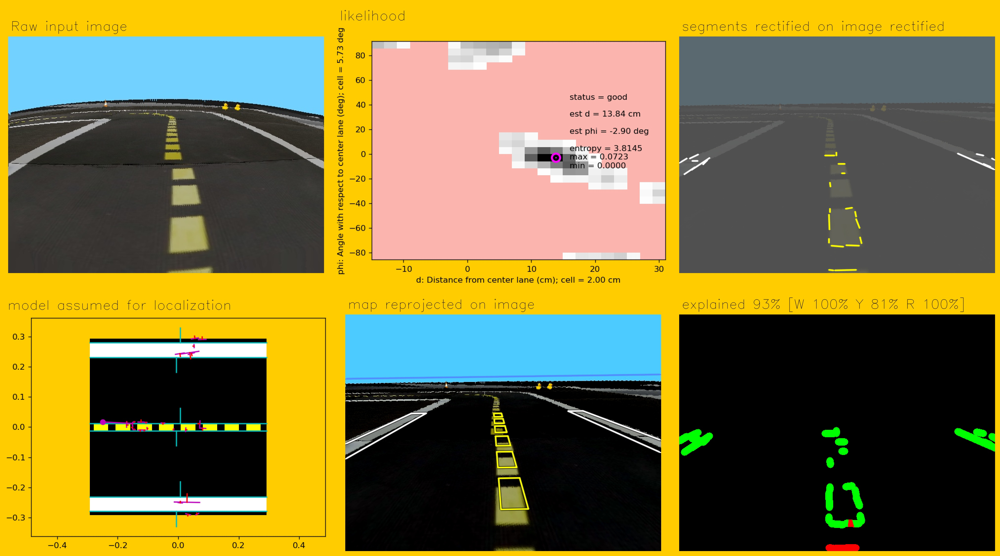

# Camera Calibration in the Duckietown simulator {#demo-sim-camera-calib status=ready}

This Demo provides general instructions to perform camera calibration in the Duckietown simulator.

## Step-By-Step Installation

### Clone the LF duckietown baseline

```
$ git clone https://github.com/duckietown/challenge-aido_LF-baseline-duckietown
```
### Navigate to the newly created directory

```
$ cd challenge-aido_LF-baseline-duckietown
```

### Prepare submodules

#### Change submodule URLs in `.gitmodules` file

* open the `.gitmodules` file.
```
$ ![your_favourite_editor] .gitmodules
```
* change line 3 from from `https://github.com/duckietown/gym-duckietown.git` to `https://github.com/ai404/gym-duckietown.git`.

* change line 7 from `https://github.com/duckietown/dt-core.git` to `https://github.com/ai404/dt-core.git`.

* save and close the file.

#### Update submodules
```
$ git submodule init
```
```
$ git submodule update --recursive
```

Don't worry if you get an error saying that the "Server does not allow request for unadvertised object ... Direct fetching of that commit failed."

#### Switch to daffy branch on all submodules
```
$ git submodule foreach "(git checkout daffy; git pull)"
```
### Build Docker Image

cd to `1_develop` and build the docker images:
```
$ cd 1_develop
$ docker-compose build
$ docker-compose up
```

### Setup the workspace
If the docker image runs properly, you will be given a link to access a jupyter notebook connected to the now-running container.
Open the jupyter notebook by following the link in a web browser. From the notebook, open a terminal, and in it do the following:

#### Install missing packages

##### Install `quickapp`
```
$ pip install quickapp
```
##### Downgrade `systemCmd` to version `2.0`
```
$ pip uninstall systemCmd
$ git clone --single-branch --branch p3 https://github.com/AndreaCensi/system_cmd
$ cd system_cmd
$ python setup.py install
```
##### Install `compmake`
```
$ pip install -U git+https://github.com/AndreaCensi/compmake/
```
#### Build and Source `catkin_ws`
```
$ catkin build --workspace catkin_ws
$ source catkin_ws/devel/setup.bash
```

#### Shut down the container
Control-C in the currently running container. Manually kill the docker containers if necessary with `docker ps` and `docker kill ![container_name]`.

## Intrinsic Calibration

### Set intrinsic calibration map

Change the `map_name` parameter in `1_develop/utils/ros_helpers.py` from `"loop_empty"` to `"calibration_map_int"`.

### Run the docker image with the new map
```
$ docker-compose up
```

### Open a terminal in the Jupyter notebook
Run the camera service in a Jupyter notebook terminal.
```
$ roslaunch pi_camera camera.launch veh:=default
```
### In a terminal on the local machine, disable access control or add localhost
```
$ xhost + 
```
### Get the ID of the notebook container
Get the Container ID of the container running from the `duckietown/dt-notebook:daffy` image. This can be done with the `docker ps` command.

### Connect to the docker container using the ID `![container_id]` you just found
```
$ docker exec -it -u root -e DISPLAY=host.docker.internal:0 ![container_id] /bin/bash
```
In this terminal you now have a command prompt directly into the container. We do this (as opposed to using a terminal from the jupyter notebook) so that we can view the GUI for duckiebot calibration.

### Perform intrinsic calibration
In this command prompt, run
```
$ roslaunch pi_camera intrinsic_calibration.launch veh:=default
```
When it launches you will get a window similar to the one you get when calibrating a real duckiebot. You can resize the window by dragging the bottom-right corner. ([](#calibration-int))

<figure id="calibration-int">
    <figcaption>Starting the intrinsic calibration.</figcaption>
     
</figure>

When calibration is succeded ([](#calibration-int-done)), the buttons `CALIBRATE` and `SAVE` will turn from grey to green:

* `SAVE` button generates a zip file at `/tmp/TODO` where you can find the images used to calibrate the camera's intrinsics as well as a yaml file with calculated parameters.
* `CALIBRATE` writes the calculated parameters directly to the apropriate path at `/data/config/calibrations/camera_intrinsic/![robot_name].yaml` using the `set_camera_info` service.

QUESTION: should we use "robot_name" or just say "default" which is what it is I guess?

<figure id="calibration-int-done">
    <figcaption>Commiting the intrinsic calibration.</figcaption>
     
</figure>

#### Shut down the container
Control-C in the currently running container. Manually kill the docker containers if necessary with `docker ps` and `docker kill ![container_name]`.

## Extrinsic Calibration

### Set extrinsic calibration map
Change the `map_name` parameter in `1_develop/utils/ros_helpers.py` to `"calibration_map_ext"`.

### Run the docker image with the new map
```
$ docker-compose up
```

### Change the default homography name
 The default name of the robot will interfere with default homography, we rename the default homography file to encounter the issue:
```
$ cp /data/config/calibrations/camera_extrinsic/default.yaml /data/config/calibrations/camera_extrinsic/default_homography.yaml
```
### Set the project root folder
Also we need to specify the project root folder in which the calibration files will be saved:
```
$ export DUCKIETOWN_ROOT=/duckietown
```
### Run the extrinsic calibration pipeline
```
$ rosrun complete_image_pipeline calibrate_extrinsics
```

You should expect to get a similar result as in ([](#calibrate-extrinsics))

<figure id="calibrate-extrinsics">
    <figcaption>The image used for Extrinsic Calibration.</figcaption>
     
</figure>

### Change the map to `loop_empty` and restart the simulator
```
$ rosrun complete_image_pipeline single_image_pipeline
```
expected results ([](#single-image-pipeline))

<figure id="single-image-pipeline">
    <figcaption>Evaluating Extrinsic Calibration.</figcaption>
     
</figure>