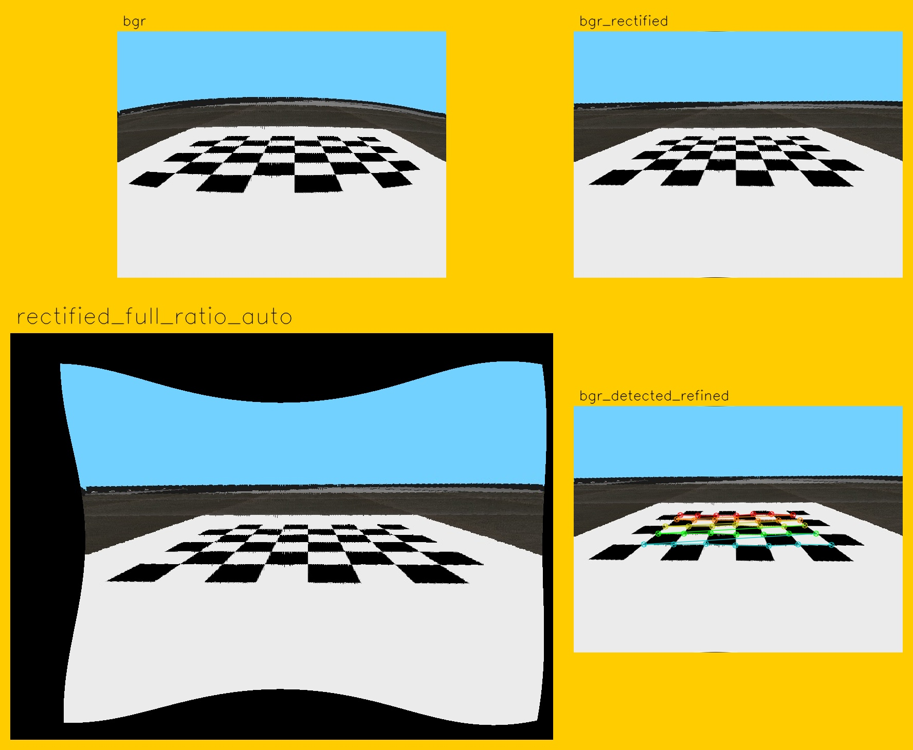

# Camera Calibration on Duckietown simulator {#demo-sim-camera-calib status=ready}

This Demo provides general instructions to perform camera calibration on duckietown simulator.

## Step-By-Step Installation

### Clone the LF duckietown baseline

```
$ git clone https://github.com/duckietown/challenge-aido_LF-baseline-duckietown
```
### Navigate to the newly created directory

```
$ cd challenge-aido_LF-baseline-duckietown
```

### Prepare submodules

#### Change submodule URLs in `.gitmodules` file

* open the `.gitmodules` file.
```
$ ![your_favourite_editor] .gitmodules
```
* change the simulation submodule URL from [duckietown/gym-duckietown](https://github.com/duckietown/gym-duckietown) to [ai404/gym-duckietown](https://github.com/ai404/gym-duckietown) on branch daffy.

* change the dt-core submodule URL from [duckietown/dt-core](https://github.com/duckietown/dt-core) to [ai404/dt-core](https://github.com/ai404/dt-core) on branch daffy.

#### Update submodules
```
$ git submodule init
```
```
$ git submodule update --recursive
```
#### Switch to daffy branch on all submodules
```
$ git submodule foreach "(git checkout daffy; git pull)"
```
### Build Docker Image

cd to `1_develop` and build the docker images:
```
$ cd 1_develop
$ docker-compose build
$ docker-compose up
```

### Setup the workspace
On the simulator container open a terminal, and in it do the following:

#### Install missing packages

##### Install `quickapp`
```
$ pip install quickapp
```
##### Downgrade `systemCmd` to version `2.0`
```
$ pip uninstall systemCmd
$ git clone --single-branch --branch p3 https://github.com/AndreaCensi/system_cmd
$ cd system_cmd
$ python setup.py install
```
##### Install `compmake`
```
$ pip install -U git+https://github.com/AndreaCensi/compmake/
```
#### Build and Source `catkin_ws`
```
$ catkin build --workspace catkin_ws
$ source catkin_ws/devel/setup.bash
```

## Intrinsic Calibration

### Set intrinsic calibration map

Change the `map_name` parameter in `1_develop/utils/ros_helpers.py` from `![loop_empty]` to `![calibration_map_int]`.

### open a terminal in the Jupyter notebook
Run the camera service in this terminal
```
$ roslaunch pi_camera camera.launch veh:=default
```
### In a terminal on the local machine, disable access control or add localhost
```
$ xhost + 
```
### Get the ID of the notebook container
Get the Container ID of the container running from the `duckietown/dt-notebook:daffy` image. This can be done with the `docker ps` command.

### Connect to the docker container using the ID `![container_id]` you just found
```
$ docker exec -it -u root -e DISPLAY=host.docker.internal:0 ![container_id] /bin/bash
```
This will open a terminal in the container.

### Perform intrinsic calibration
```
$ roslaunch pi_camera intrinsic_calibration.launch veh:=default
```
When it launchs you will get a window similar to the one you get when calibrating a real duckiebot ([](#calibration-int))

<figure id="calibration-int">
    <figcaption>Starting the intrinsic calibration.</figcaption>
     
</figure>
When calibration is succeded ([](#calibration-int-done)) the buttons `CALIBRATE` and `SAVE` will activate:

* `SAVE` button generates a zip file at `/tmp/TODO` where you can find the images used to calibrate the camera's intrinsics but also a yaml file with calculated parameters.
* `CALIBRATE` writes directly the parameters to the apropriate path at `/data/config/calibrations/camera_intrinsic/![robot_name].yaml` using the `set_camera_info` service.

<figure id="calibration-int-done">
    <figcaption>Commiting the intrinsic calibration.</figcaption>
     
</figure>
## Extrinsic Calibration
### Set extrinsic calibration map

Change the `map_name` parameter in `1_develop/utils/ros_helpers.py` to `![calibration_map_ext]`.

### Change the default homography name
 The default name of the robot will interfere with default homography, we rename the default homography file to encounter the issue:
```
$ cp /data/config/calibrations/camera_extrinsic/default.yaml /data/config/calibrations/camera_extrinsic/default_homography.yaml
```
### Set the project root folder
Also we need to specify the project root folder in which the calibration files will be saved:
```
$ export DUCKIETOWN_ROOT=/duckietown
```
### run the extrinsic calibration pipeline
```
$ rosrun complete_image_pipeline calibrate_extrinsics
```

You should expect to get a similar result as in ([](#calibrate-extrinsics))

<figure id="calibrate-extrinsics">
    <figcaption>The image used for Extrinsic Calibration.</figcaption>
     
</figure>

### Change the map to `loop_empty` and restart the simulator
```
$ rosrun complete_image_pipeline single_image_pipeline
```
expected results ([](#single-image-pipeline))

<figure id="single-image-pipeline">
    <figcaption>Evaluating Extrinsic Calibration.</figcaption>
     
</figure>